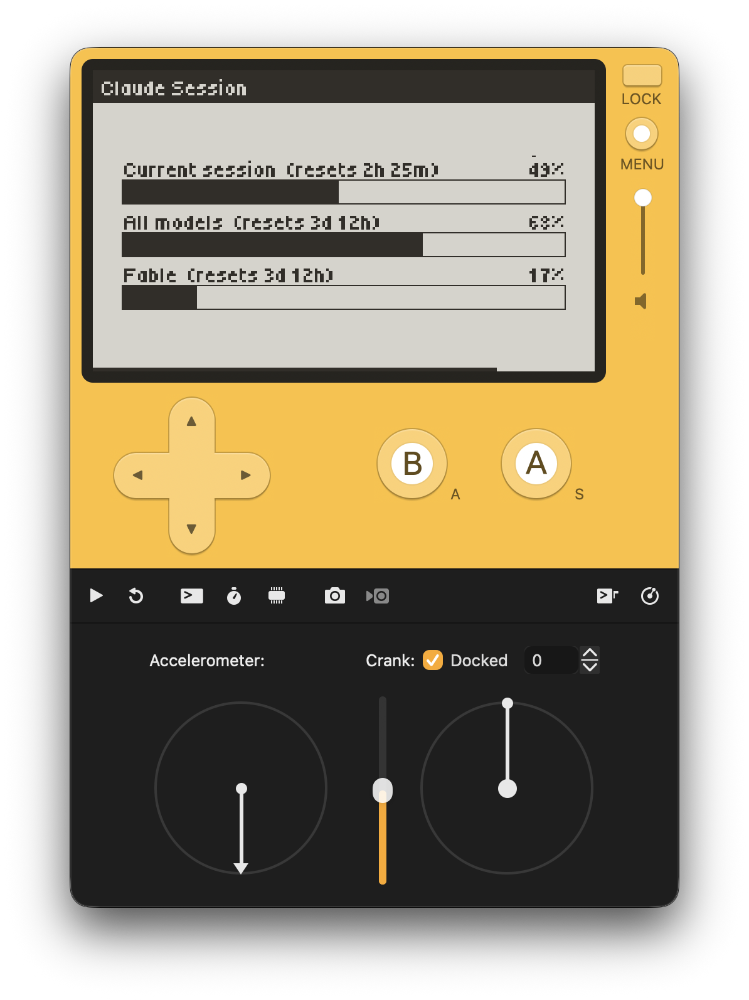

# Claude Session



Claude plan-usage limits (the claude.ai "Plan usage limits" screen) on a Playdate.
Monorepo: a Playdate C app at the root renders three usage bars; a tiny Go server
in `server/` exposes the data as one GET call.

```
.
├── src/main.c     # Playdate app — single file, all logic
├── Source/        # assets bundled into .pdx by pdc (pdxinfo, fonts)
├── build.sh       # build wrapper (make + pdc)
├── setup.sh       # interactive first-time setup (deploy server + write config)
└── server/        # Go backend, deployed on fly.io
```

## Quick start

```sh
./setup.sh
```

Asks a few questions (fly.io app name, region, bundle ID), then: creates the
fly app + volume, generates the device auth token, walks you through the
Claude OAuth login, deploys, writes `src/config.h`, and builds the `.pdx`.
Prerequisites: [Playdate SDK](https://play.date/dev/) ≥ 2.7, Go,
[flyctl](https://fly.io/docs/flyctl/) (logged in), a Claude subscription.

The rest of this README is the manual version of the above, plus reference.

## Playdate app

### Build & run

```sh
make clean && make
open -a "$PLAYDATE_SDK_PATH/bin/Playdate Simulator.app" ClaudeSession.pdx
```

Or `./build.sh` (wraps the same steps). SDK path comes from the
`PLAYDATE_SDK_PATH` env var or `~/.Playdate/config`. Requires SDK ≥ 2.7
(network API).

### Config / secrets

- `src/config.h` (gitignored) holds `SERVER_HOST` + `AUTH_TOKEN` — the fly.io
  secret gating the backend, NOT an Anthropic API key.
- `src/config.h.example` is the committed template. Copy to `src/config.h` and
  fill in `AUTH_TOKEN` from `server/.auth_token.local`.

### Behavior

- 3 solid bars with labels above (`label  (resets Xh Ym)`), percentage right-aligned
- Network permission is requested on the FIRST UPDATE FRAME (never at
  `kEventInit` — the permission dialog deadlocks at load time), then GET on the
  "Interval" menu cadence (1 min / 5 min, default 5 min)
- Countdown bar at the bottom; hidden until the first data arrives, and paused
  while a fetch is in flight
- Ding (sine synth) on every successful refresh
- "No Sleep" menu checkbox (default on) disables auto-lock so the screen stays on
- Hold A 3 s → force refresh (progress bar in header); failed fetches retry in
  5 s (net) / 15 s (HTTP); the server caches 60 s so forced refreshes are cheap
- Parse: `strtok` on newlines + `|` (see `parseBody`); buffer cap 1 KB
- Errors drawn centered (`HTTP 401`, `net err -16`, "network access denied");
  `stale` badge top-right when the server serves cached data
- Font: Tiny5 (`.fnt` + `.png` compiled to `.pft` by `pdc`), loaded as `"Tiny5"`

### Gotchas

- `pd->network->setEnabled` MUST get a non-NULL callback: firmware (3.0.6)
  invokes it without a NULL check — passing NULL crashes the device with
  "Error accessing buffer at 0x00000000" (works fine in the simulator, which
  never fires the callback)
- HTTP callbacks run off the main thread — set flags there, act in `update()`
  (that's why the ding is played via `dingPending`)
- White text on black: `setDrawMode(kDrawModeFillWhite)` before `drawText`,
  then restore with `kDrawModeCopy`
- Screen is 400×240; `LCD_COLUMNS` / `LCD_ROWS` available

## Server

Tiny Go backend that exposes the usage limits as **one GET call**, meant to be
polled by the Playdate.

### Why

The usage data is only served by Anthropic's OAuth-only endpoint
(`api.anthropic.com/api/oauth/usage`) — there is no API-key way to get it, and
the OAuth token lives inside Claude Code's credential store. This server hides
all of that:

1. Reads the Claude Code OAuth token from the macOS Keychain
   (`Claude Code-credentials`), falling back to `~/.claude/.credentials.json`.
2. Calls the usage endpoint with the required `anthropic-beta: oauth-2025-04-20` header.
3. Reshapes the response into a small, Playdate-friendly payload with
   pre-formatted countdowns.
4. Caches for 60s (and serves stale up to 15 min on upstream failure) so the
   device can poll freely.

**Note on token refresh:** this server never uses the refresh token. Anthropic
rotates refresh tokens on use, so refreshing here would invalidate Claude Code's
stored token and break its login. If the stored access token has expired, the
server returns an error telling you to run `claude` once (which refreshes the
Keychain entry).

### Run

```sh
cd server
go run .          # listens on :8080
PORT=9000 go run .
```

Optional env (also loadable from `.env` / `.env.dev` / `.env.prod`, `APP_ENV`
picks the profile):

| var | effect |
|-----|--------|
| `PORT` | listen port (default 8080) |
| `AUTH_TOKEN` | if set, `/api/usage` requires `Authorization: Bearer <token>` or `?token=<token>` |
| `LOG_LEVEL` | debug \| info \| warn \| error |
| `APP_ENV` | `prod` switches logs to JSON |

### API

`GET /api/usage`

```json
{
  "session": { "percent": 34, "severity": "normal", "resets_at": "2026-07-08T14:20:00Z", "resets_in_secs": 16320, "resets_in": "4h 32m" },
  "weekly":  { "percent": 56, "severity": "normal", "resets_at": "2026-07-12T07:00:00Z", "resets_in_secs": 341989, "resets_in": "3d 22h" },
  "models":  [ { "name": "Fable", "percent": 2, "severity": "normal", "resets_at": "...", "resets_in_secs": 341989, "resets_in": "3d 22h" } ],
  "fetched_at": "2026-07-08T09:48:00Z"
}
```

`"stale": true` appears when upstream failed and a cached payload (≤15 min old)
was served instead.

`GET /api/usage?format=plain` — pipe-separated lines for clients without a JSON
parser (the Playdate app):

```
ok            ← or "stale"
session|63|1h 57m
weekly|59|3d 18h
Fable|6|3d 18h
```

Line format after the status line: `<name>|<percent>|<resets_in>`. `session` and
`weekly` are fixed keys; any further lines are per-model limits named by their
display name.

`GET /api/health` → `ok`

### Deploy (fly.io)

One-time setup (`./setup.sh` automates all of this):

```sh
cd server
fly apps create <app>
fly volumes create data --region <region> --size 1 -a <app>   # persists rotated oauth tokens
fly secrets set AUTH_TOKEN=$(openssl rand -hex 24) -a <app>
go run ./cmd/login   # browser approve → paste code → prints credentials JSON
fly secrets set CLAUDE_CREDENTIALS='<json from login>' -a <app>
fly deploy --ha=false
```

`cmd/login` creates a *dedicated* OAuth session for the server (PKCE flow, same
client id as Claude Code). This matters: Anthropic rotates refresh tokens on
use, so the server refreshing a *shared* token would log Claude Code out. With
its own session it refreshes freely and persists rotated tokens to the volume
(`CREDENTIALS_FILE=/data/credentials.json`, set in fly.toml).

If the server ever loses its session (revoked, volume wiped with a stale
secret), `/api/usage` returns an error saying so — rerun `go run ./cmd/login`
and update the secret.

#### Deployment shape

- Single shared-cpu 256 MB machine, `--ha=false`
- Volume `data` (1 GB) mounted at `/data` — holds `credentials.json` with the
  latest rotated OAuth tokens
- `auto_stop_machines`: machine sleeps when idle, wakes on request (first poll
  after idle ~1–2 s slower); cost is effectively zero at Playdate polling rates
- Health check: `GET /api/health` every 30 s

#### Operations

```sh
cd server
fly logs -a <app>          # tail server logs
fly status -a <app>        # machine state
fly deploy --ha=false      # ship code changes

# rotate the Playdate-facing token (then update src/config.h and rebuild the pdx):
openssl rand -hex 24 > .auth_token.local
fly secrets set AUTH_TOKEN=$(cat .auth_token.local) -a <app>

# replace the server's Claude session (e.g. after revoking it):
go run ./cmd/login
fly secrets set CLAUDE_CREDENTIALS='<json>' -a <app>
```

Setting a secret restarts the machine automatically. The volume copy of the
credentials (`/data/credentials.json`) takes precedence over the
`CLAUDE_CREDENTIALS` secret, so after replacing the session also clear the old
file: `fly ssh console -a <app> -C "rm /data/credentials.json"`
(machine must be awake — hit `/api/health` first).

### Caveats

- Running locally (Keychain mode): the server must run on the Mac where Claude
  Code is logged in — first run prompts Keychain permission for the built
  binary — and token freshness depends on Claude Code being used occasionally
  (the access token expires after several hours otherwise). The fly.io
  deployment avoids all this via its dedicated OAuth session.
- `api.anthropic.com/api/oauth/usage` is an undocumented internal endpoint —
  field names may change.
